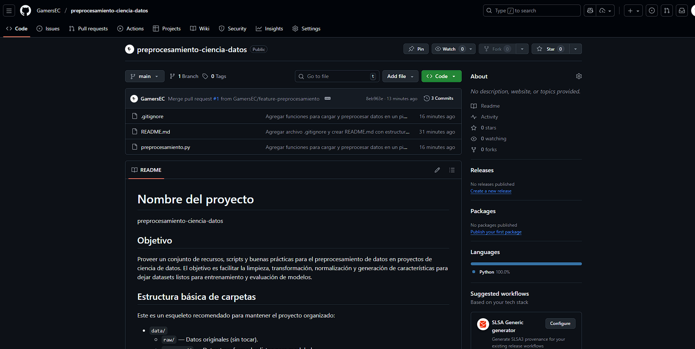
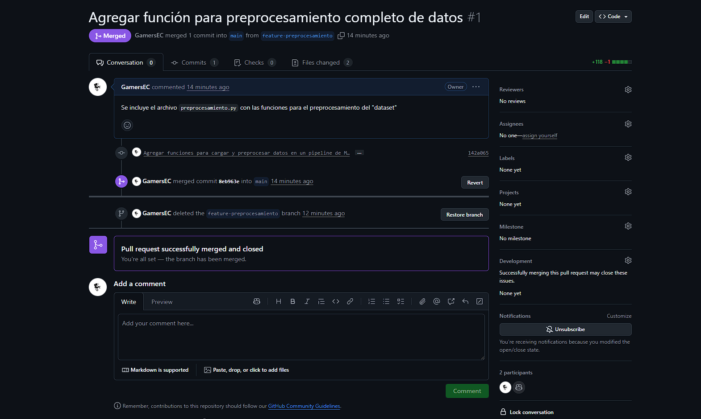
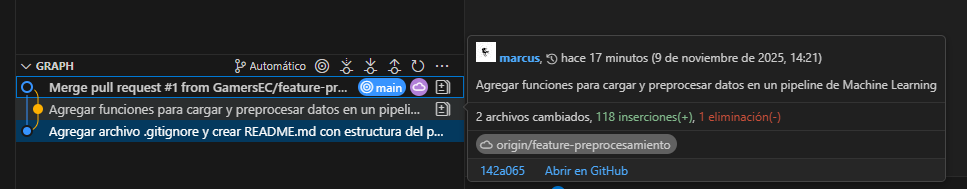

# DOCUMENTACIÓN
## Actividad autonomas #3
## Datos Personales:
#### Nombre: Marcus Mayorga
#### Fecha: 09 de noviembre del 2025

## 1. Introducción

Este repositorio contiene utilidades y scripts para el preprocesamiento de datos orientado a proyectos de ciencia de datos. El objetivo es proporcionar una base reproducible para limpiar, transformar y preparar datos antes de los pasos de modelado o análisis.

En este documento se explica la finalidad del proyecto, los comandos Git habituales que se usan en el flujo de trabajo, una descripción de la automatización por medio de GitHub Actions y qué evidencias (capturas) guardar.

## 2. Objetivos

- Proveer scripts y ejemplos para el preprocesamiento de datos.
- Mantener un flujo de trabajo reproducible con control de versiones.
- Integrar validaciones/CI mediante GitHub Actions (opcional según el proyecto).

## 3. Estructura del repositorio

Contenido principal (ejemplos, puede variar):

- `preprocesamiento.py`: Script principal de preprocesamiento.
- `README.md`: Información general del proyecto.
- `DOCUMENTACION.md`: Este archivo (documentación y guías).

## 4. Comandos Git usados (ejemplos)

A continuación se listan los comandos Git más usados en este proyecto, con ejemplos claros:

Inicializar un repositorio (solo la primera vez):

```powershell
git init
```

Agregar cambios al área de staging:

```powershell
git add .
```

Hacer commit con mensaje descriptivo:

```powershell
git commit -m "Descripción breve de los cambios"
```

Enviar la rama actual al remoto:

```powershell
git push origin nombre_de_la_rama
```

Ver el estado del repositorio:

```powershell
git status
```

Cambiar de rama:

```powershell
git checkout nombre_de_la_rama
```

Eliminar una rama local (cuando ya está fusionada):

```powershell
git branch -d nombre_de_la_rama
```

## 5. Automatización (GitHub Actions)

- Activadores: `push` y `pull_request` sobre `main` o ramas de features.
- Pasos típicos:
	- Checkout del código (`actions/checkout`).
	- Configurar Python (`actions/setup-python`).
	- Instalar dependencias (por ejemplo `pip install -r requirements.txt`).
	- Ejecutar linters y tests (`pytest`, `flake8`, `pylint`, etc.).
	- Reportar resultados y artefactos (opcional).


## 6. Capturas de pantalla / Evidencias


